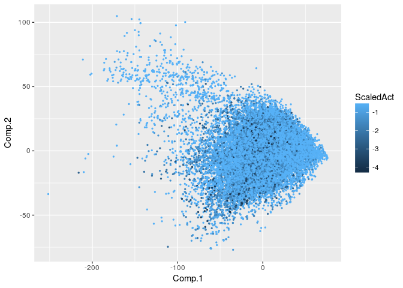
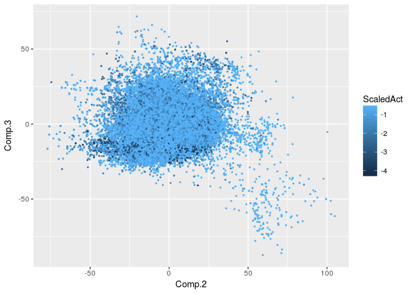

Predict molecular activity using Neural Networks implemented with Keras and Tensorflow
================

### 1) Load libraries

First we'll load all the required libraries and data.

``` r
library ("caret")
```

    ## Loading required package: lattice

    ## Loading required package: ggplot2

``` r
library ("dplyr")
```

    ## 
    ## Attaching package: 'dplyr'

    ## The following objects are masked from 'package:stats':
    ## 
    ##     filter, lag

    ## The following objects are masked from 'package:base':
    ## 
    ##     intersect, setdiff, setequal, union

``` r
library(keras)
library (readr)
library (tensorflow)
Train.df <- readRDS("Trian.df_Jul042017.rds")
```

### 2) Create Validation Set and Discrete Outcomes

Now that we have read in the data we'll create a validation set so that we can test how our model is performing later. The outcome that we want to predict varies continuously within a range of 4.3 to 8. But, for all practical purposes we don't really want to predict the precise activity as long as we are in the right ball-park. So we are going to make the outcome discrete by binning them into windows. We can choose the bins of any size depending on the desired amount of prediction resolution, and also the amount of information content in the parameters.

``` r
#### Bin continuous variable into bins to make it discrete ####
Act_Discrete <- Train.df$Act
Discrete_Temp <- ceiling (Train.df$Act) - round(Train.df$Act)
Index_Ones <- which(Discrete_Temp == 1)
Act_Discrete[Index_Ones] <- round(Act_Discrete[Index_Ones])
Act_Discrete[-Index_Ones] <- ceiling(Train.df$Act[-Index_Ones]) - 0.5
#### Now create a validation set ####
ValidationSet <- createDataPartition(y = Act_Discrete, times = 1, p = 0.75, list = F)
Train_Validation.df <- Train.df[-ValidationSet,]
Train.df <- Train.df[ValidationSet,]
### Split the discrete outcome variable in the same way as data ####
Act_Discrete_Validation <- Act_Discrete[-ValidationSet]
Act_Discrete <- Act_Discrete[ValidationSet]
```

### 3) Visualize the Data

The number of parameters in the data are in the thousands. So we'll use PCA to visualize data and get some sense of what it all means.

``` r
Fit_PrincComp <- princomp(Train.df[,3:ncol(Train.df)])
MidAct <- max(Train.df$Act) - min(Train.df$Act)
ScaledAct <- MidAct - Train.df$Act
MyData_PrinComp <- data.frame(Fit_PrincComp$scores)
```

First we'll print a plot of PC1 and PC2.

``` r
p1 <- ggplot(MyData_PrinComp)
p1 <- p1 + geom_point(aes(Comp.1,Comp.2, color = ScaledAct), alpha = 1, size = 0.5) 
p1
```



We'll also look at how a plot of PC2 and PC3 looks.

``` r
p1 <- ggplot(MyData_PrinComp)
p1 <- p1 + geom_point(aes(Comp.2,Comp.3, color = ScaledAct), alpha = 1, size = 0.5) 
p1
```



Principal component plots show that based on the prediction parameters the samples do not fall into tight clusters. If we color them by activity we can observe that PC3 seems to form somewhat of a cluster of highly active molecules. Though the clusters are not exclusive, they do capture some information about the molecule's activity which can be used for prediction.

#### 4) Create TF model using Keras

We are going to use all the features for prediction. Since we know that PC3 also has some predictive value, we'll include PC1 2 and 3

``` r
PC.Act.df <- t(Fit_PrincComp$loadings[,1:3]) %*% t(as.matrix(Train.df[,3:ncol(Train.df)]))
PC.Act.df <- t(PC.Act.df)
### Add the three informative PCs to the parameter list
Train.df <- cbind (Train.df, PC.Act.df)
```

Since there are very few rows with high activity and an overwhelming majority of rows have the lowest levels of activity, we are at a danger of training our model to just predict low activity all the time. This would defeat the purpose of identifying those molecules which might have high molecular activity. To prevent this from happening we'll make several small chunks of the data. Each chunk will have all of the less-frequent, high activity molecules, and a random sample of the highly-frequent low activity molecules. We'll then iteratively train our model with all theses chunks, updating the weights from the previous training chunk as we go along.

``` r
######
Level_Length <- length(levels(factor(Act_Discrete)))
ActDiscrete_Table <- table(Act_Discrete)
Max_N <- 486
TotalRows <- 1040
Category_Pool <- lapply(1:length(ActDiscrete_Table), FUN = function(i) {sort(which(Act_Discrete == names(ActDiscrete_Table[i])))})
Category_Pool_ToKeep <- Category_Pool
AboveCutOff <- which(ActDiscrete_Table > Max_N)
BelowCutOff <- which(ActDiscrete_Table < Max_N)
#### Define model #######
model_trimmed <- keras_model_sequential()
model_trimmed %>% 
  layer_dense(units = TotalRows, activation = 'relu', input_shape = c(9494)) %>% 
  layer_dropout(rate = 0.3) %>% 
  layer_dense(units = TotalRows, activation = 'relu') %>%
  layer_dropout(rate = 0.2) %>%
  layer_dense(units = 9, activation = 'softmax')
summary (model_trimmed)
```

    ## Model
    ## ___________________________________________________________________________
    ## Layer (type)                     Output Shape                  Param #     
    ## ===========================================================================
    ## dense_1 (Dense)                  (None, 1040)                  9874800     
    ## ___________________________________________________________________________
    ## dropout_1 (Dropout)              (None, 1040)                  0           
    ## ___________________________________________________________________________
    ## dense_2 (Dense)                  (None, 1040)                  1082640     
    ## ___________________________________________________________________________
    ## dropout_2 (Dropout)              (None, 1040)                  0           
    ## ___________________________________________________________________________
    ## dense_3 (Dense)                  (None, 9)                     9369        
    ## ===========================================================================
    ## Total params: 10,966,809
    ## Trainable params: 10,966,809
    ## Non-trainable params: 0
    ## ___________________________________________________________________________
    ## 
    ## 

``` r
model_trimmed %>% compile(
  loss = 'categorical_crossentropy',
  optimizer = optimizer_sgd(lr = 0.0005, decay = 0.0001),
  metrics = c('accuracy'))
NumEpoch <- 10
#for (i in 1:ceiling(table(Act_Discrete)[1]/Max_N)){}
for (i in 1:ceiling(table(Act_Discrete)[1]/Max_N))
{
  Train.df.trimmed <- NULL
  for (j in AboveCutOff)
  {
    if (length(Category_Pool_ToKeep[[j]]) > Max_N)
    {
      Temp <- sort(sample(Category_Pool_ToKeep[[j]], size = Max_N, replace = F))
      Train.df.trimmed <- rbind(Train.df.trimmed, Train.df[Temp,])
      Category_Pool_ToKeep[[j]] <- setdiff (Category_Pool_ToKeep[[j]], Temp)
    } else
    {
      Temp <- Category_Pool_ToKeep[[j]]
      NumDiff <- Max_N - length(Category_Pool_ToKeep[[j]])
      Category_Pool_ToKeep[[j]] <- Category_Pool[[j]]
      Temp <- c(Temp, sort(sample(Category_Pool_ToKeep[[j]], size = NumDiff, replace = F)))
      Train.df.trimmed <- rbind(Train.df.trimmed, Train.df[Temp,])
      Category_Pool_ToKeep[[j]] <- setdiff (Category_Pool_ToKeep[[j]], Temp)
    }
    
  }
  for (jj in BelowCutOff)
  {
    Train.df.trimmed <- rbind(Train.df.trimmed, Train.df[Category_Pool_ToKeep[[jj]],])
  }
  Train.df.trimmed <- Train.df.trimmed[sample(1:nrow(Train.df.trimmed), size = nrow(Train.df.trimmed), replace = F),]
  Act_Discrete_Trimmed <- Train.df.trimmed$Act
  Discrete_Temp <- ceiling (Train.df.trimmed$Act) - round(Train.df.trimmed$Act)
  Index_Ones <- which(Discrete_Temp == 1)
  Act_Discrete_Trimmed[Index_Ones] <- round(Act_Discrete_Trimmed[Index_Ones])
  Act_Discrete_Trimmed[-Index_Ones] <- ceiling(Train.df.trimmed$Act[-Index_Ones]) - 0.5
  One_Hot_Matrix <- matrix(nrow = nrow(Train.df.trimmed), ncol = length(levels(factor(Act_Discrete_Trimmed))))
  colnames(One_Hot_Matrix) <- levels(factor(Act_Discrete_Trimmed))
  for(ii in 1:length(levels(factor(Act_Discrete_Trimmed))))
  {
    Temp_Index <- which(Act_Discrete_Trimmed == levels(factor(Act_Discrete_Trimmed))[ii])
    One_Hot_Matrix[,ii] <- 0
    One_Hot_Matrix[Temp_Index,ii] <- 1
  }
  TotalRows <- nrow(Train.df.trimmed)
  #PC.Act.df <- t(Fit_PrincComp$loadings[,1:50]) %*% t(as.matrix(Train.df.trimmed[,3:ncol(Train.df.trimmed)]))
  #PC.Act.df <- t(PC.Act.df)
  
    history_trimmed <- model_trimmed %>% fit(
    x = as.matrix(Train.df.trimmed[,3:ncol(Train.df.trimmed)]), y = One_Hot_Matrix, 
    epochs = NumEpoch, batch_size = 96, 
    validation_split = 0.2
  )
    NumEpoch <- NumEpoch + 10
  plot(history_trimmed)
  
}
#### Save model after all the hard work ####
save_model_hdf5(object=model_trimmed, filepath = paste0("model_trimmed_", format(Sys.time(), "%b_%d_%Y_%H.%M.%S.%Z"), ".hdf5"), overwrite = TRUE,
                include_optimizer = TRUE)
```

### 5) Declare R-Squared Function and Test the OutPut

Now we'll declare a function to calculate R-squared and use to test our prediction on the validation set we created at the beginning.

``` r
Rsquared <- function(x,y) {
  # Returns R-squared.
  # R2 = \frac{[\sum_i(x_i-\bar x)(y_i-\bar y)]^2}{\sum_i(x_i-\bar x)^2 \sum_j(y_j-\bar y)^2}
  # Arugments: x = solution activities
  #            y = predicted activities
  
  if ( length(x) != length(y) ) {
    warning("Input vectors must be same length!")
  }
  else {
    avx <- mean(x) 
    avy <- mean(y)
    num <- sum( (x-avx)*(y-avy) )
    num <- num*num
    denom <- sum( (x-avx)*(x-avx) ) * sum( (y-avy)*(y-avy) )
    return(num/denom)
  }
}
PC.Act.df.Validation <- t(Fit_PrincComp$loadings[,1:3]) %*% t(as.matrix(Train_Validation.df[,3:(ncol(Train.df) -3) ]))
PC.Act.df.Validation <- t(PC.Act.df.Validation)
Train_Validation.df <- cbind(Train_Validation.df, PC.Act.df.Validation)
Myclasses <- model_trimmed %>% predict_classes(as.matrix(Train_Validation.df[,3:ncol(Train_Validation.df)]), batch_size = 128)
print (paste0("Our final R-Squared Value is: ", Rsquared(x = Train_Validation.df$Act, y = Myclasses)))
```

    ## [1] "Our final R-Squared Value is: 0.494778923184077"


